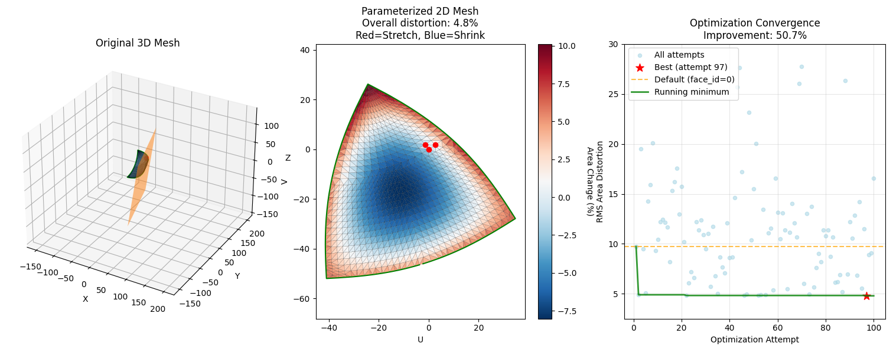

# STL Surface Flattening Tool

Flattens 3D STL surfaces into 2D patterns using LSCM (Least Squares Conformal Mapping), with optimization to minimize distortion. Similar to SolidWorks' "Flattening Surfaces" feature.

## Features

- **LSCM Parameterization**: Preserves angles while minimizing distortion
- **Initial Point Optimization**: Automatically finds optimal starting points (10-50% distortion reduction)
- **Distortion Analysis**: Visual heatmap showing percentage area change between 3D and 2D
- **Multiple Output Formats**: PNG visualization, SVG and DXF export
- **Interactive GUI**: File dialog for easy STL selection

## Installation

```bash
python3 -m venv venv
source ./venv/bin/activate
pip install -r requirements_minimal.txt
```

## Usage

```bash
# Basic usage (interactive file selection)
python main.py

# With optimization (recommended)
python main.py --optimize

# Process specific file with custom optimization
python main.py input.stl --optimize --attempts 100

# Use specific initial face (no optimization)
python main.py input.stl --face-id 25
```

**Options:**
- `--optimize`: Enable distortion optimization (default: 50 attempts)
- `--attempts N`: Number of optimization attempts 
- `--face-id ID`: Specific face for initial points (ignored with `--optimize`)
- `--output-dxf PATH`: Custom DXF output path
- `--output-svg PATH`: Custom SVG output path

## How It Works

1. **Load STL**: Reads mesh vertices and faces
2. **Boundary Detection**: Finds surface boundaries using `igl.boundary_facets()`
3. **Optimization** (optional): Tests different initial points to minimize distortion
4. **LSCM Flattening**: Computes 2D UV coordinates using `igl.lscm()`
5. **Visualization**: Shows 3D mesh, 2D result, and optimization convergence

## Distortion Optimization

**Metric**: RMS of per-triangle area differences: `sqrt(mean(|3D_area - 2D_area|²))`

**Practical Significance**: The overall distortion percentage indicates how much the 2D pattern differs from the original 3D surface. For fabric manufacturing, most materials can accommodate up to 4% distortion without significant issues. Higher values may result in:
- Fabric puckering or stretching
- Pattern pieces that don't fit properly when assembled
- Visible distortion in the final product

**Color Visualization**: Red areas indicate stretching (positive %), blue areas indicate compression (negative %)

**Algorithm**: Brute force search over candidate faces (random + boundary-biased selection)

## Output Quality

Result quality depends heavily on the initial mesh. If the initial mesh is not a [developable surface](https://en.wikipedia.org/wiki/Developable_surface)[^1], using the `--optimize` parameter will be beneficial.

The below figures show that by selecting the optimal point from which to unfold the overall distortion of the resulting 2D flattened mesh.

Without fixed point optimization:


With fixed point optimization:


[^1]: In other words it cannot be flattened onto a plane without any distortion such as stretching/shrinking or tearing.
